<div align="center">

<!-- Animated Header -->


<p align="center">
  
</p>

<!-- Badges with Animation -->
<p align="center">
  
  
  
  
</p>

<!-- Animated Stats -->
<p align="center">
  
  
  
</p>

<!-- Navigation -->
<p align="center">
  <a href="#-the-revolution"><kbd>🌟 Revolution</kbd></a> •
  <a href="#-core-innovation"><kbd>🧠 Innovation</kbd></a> •
  <a href="#-key-features"><kbd>✨ Features</kbd></a> •
  <a href="#-live-demo"><kbd>🎬 Demo</kbd></a> •
  <a href="#-quick-start"><kbd>⚡ Start</kbd></a> •
  <a href="#-roadmap"><kbd>🗺️ Roadmap</kbd></a> •
  <a href="#-developer"><kbd>👨‍💻 Creator</kbd></a>
</p>

<br/>

<!-- Animated Divider -->


</div>

## 🌟 The Revolution

<table>
<tr>
<td width="50%">

### ❌ The Problem

<br/>

```diff
- Generic lessons that waste your time
- No memory of your actual mistakes
- Random practice with zero targeting
- Fake personalization algorithms
- Reset context every single session
```

<br/>

**Students waste MONTHS on irrelevant practice.**

</td>
<td width="50%">

### ✅ Our Solution

<br/>

```diff
+ Persistent learner memory system
+ Tracks EVERY mistake you make
+ Prescribes exactly what YOU need
+ Gets smarter the longer you use it
+ Diagnostic science, not content spam
```

<br/>

**LinguaCoach = Your AI Language Doctor**

</td>
</tr>
</table>

<div align="center">

### 💬 What Users Say

> *"It feels like a personal tutor, not a chatbot."*  
> **— Beta User**

<br/>


</div>

## 🧠 Core Innovation

<div align="center">

### **🔥 Persistent Learner Memory System 🔥**

*The game-changer that destroys the competition*

</div>

<br/>

<table>
<tr>
<td width="33%" align="center">

### 📝 **TRACKS**


Every grammar error  
Every filler word  
Every speaking habit  

**With severity scores (1-5)**  
**With real examples**

</td>
<td width="33%" align="center">

### 🎯 **PRESCRIBES**


AI analyzes patterns  
Finds biggest gaps  
Tells you exactly what to drill  

**No guessing**  
**No random practice**

</td>
<td width="33%" align="center">

### 📈 **EVOLVES**


Gets smarter over time  
Learns your patterns  
Adapts coaching style  

**Truly personalized**  
**Actually intelligent**

</td>
</tr>
</table>

<div align="center">

### 🏆 Result


</div>

<br/>


## ✨ Key Features

<div align="center">

### 🎨 **Complete AI Coaching Suite**

</div>

<br/>

<table>
<tr>
<td width="50%">

#### 📝 **Writing Analysis Engine**

- ✅ Article detection (a/an/the)
- ✅ Tense consistency checks
- ✅ Repetition & vocabulary analysis
- ✅ Structure coherence scoring
- ✅ IELTS Band 0-9 rubric
- ✅ AI-suggested rewrites
- ✅ Focused grammar drills

<br/>

<details>
<summary><b>📊 See Sample Output</b></summary>

```
Band Score: 6.5/9
Top Issues:
  1. Article usage (12 errors) - Severity: 4/5
  2. Past tense shifts (8 errors) - Severity: 3/5
  3. Word repetition (5 instances) - Severity: 2/5

Suggested Drill: Article Practice (a/an/the)
```

</details>

</td>
<td width="50%">

#### 🎤 **Speaking Analysis Engine**

- 🎙️ WPM fluency tracking
- 🎙️ Filler word detection (um, uh, like)
- 🎙️ Structure & organization scoring
- 🎙️ Vocabulary sophistication
- 🎙️ Grammar accuracy checks
- 🎙️ Real-time feedback
- 🎙️ Pronunciation coaching

<br/>

<details>
<summary><b>📊 See Sample Output</b></summary>

```
Fluency: 145 WPM (Target: 150-160)
Fillers: 18 detected (um: 12, uh: 6)
Structure: 7.5/9
Vocabulary: 6.8/9

Next Action: Reduce filler words by 50%
```

</details>

</td>
</tr>
</table>

<br/>

<table>
<tr>
<td width="50%">

#### 📹 **Delivery Tracking**

- 👁️ Eye contact monitoring
- 💪 Body motion analysis
- 😊 Confidence scoring
- 🎭 Professional presence
- 📊 Video-based feedback

</td>
<td width="50%">

#### 🎯 **Next Best Action AI**

- 🔍 Diagnoses top 3 issues
- 💊 Prescribes focused drills
- 📈 Tracks improvement
- 🧭 Guides learning path
- ⚡ Zero guesswork

</td>
</tr>
</table>

<br/>

<table>
<tr>
<td width="50%">

#### 📚 **Smart Learning Center**

- 🤖 AI-generated lessons
- 📝 From YOUR mistakes
- 🎯 Personalized drills
- 📖 Grammar deep-dives
- 💡 Vocabulary builders

</td>
<td width="50%">

#### 📊 **Advanced Analytics**

- 📈 Performance trends
- 🗂️ Attempt history
- 📄 PDF/CSV exports
- 🔍 Pattern identification
- 📉 Weakness tracking

</td>
</tr>
</table>

<br/>

<div align="center">

</div>

## 🏆 Competitive Domination

<div align="center">

### **Why We CRUSH the Competition**

<br/>

| Feature |  | Duolingo | IELTS Apps | Cambridge |
|---------|:---:|:---:|:---:|:---:|
| **🧠 Persistent Memory** | ✅ **YES** | ❌ No | ⚠️ Weak | ⚠️ Weak |
| **🎯 Next Best Action** | ✅ **YES** | ❌ No | ❌ No | ⚠️ Weak |
| **📹 Delivery Tracking** | ✅ **YES** | ❌ No | ❌ No | ❌ No |
| **🔍 Transparent Scoring** | ✅ **YES** | ❌ No | ⚠️ Weak | ✅ Yes |
| **🏢 B2B Ready** | ✅ **YES** | ❌ No | ⚠️ Weak | ⚠️ Weak |
| **📄 Export Reports** | ✅ **YES** | ⚠️ Weak | ⚠️ Weak | ⚠️ Weak |
| **💰 ROI for Schools** | ✅ **60% Cost Cut** | ❌ No | ❌ No | ⚠️ Minimal |

<br/>

### 🎯 **Our Unfair Advantage**


</div>

<br/>


## 🎬 Live Demo

<div align="center">

### **See LinguaCoach in Action** 🚀

</div>

<br/>

### 🎯 2-Minute Demo Flow

```mermaid
%%{init: {'theme':'dark'}}%%
graph LR
    A[🎯 Set Target] -->|IELTS Band 7+| B[📝 Submit Writing]
    B -->|Instant Analysis| C[🤖 AI Feedback]
    C -->|View Results| D[🧠 Learner Memory]
    D -->|Track Progress| E[📊 Analytics]
    E -->|Download| F[📄 PDF Report]
    
    style A fill:#00D9FF,stroke:#00A4EF,stroke-width:3px,color:#000
    style C fill:#FFB800,stroke:#FF6B6B,stroke-width:3px,color:#000
    style F fill:#00E676,stroke:#00C853,stroke-width:3px,color:#000
```



<br/>

### 📋 Step-by-Step Experience

<table>
<tr>
<td width="20%" align="center">

**1️⃣**  
🎯  
**Set Goal**

IELTS Band 7+

</td>
<td width="20%" align="center">

**2️⃣**  
📝  
**Submit**

Paste writing sample

</td>
<td width="20%" align="center">

**3️⃣**  
🤖  
**Analyze**

Instant AI feedback

</td>
<td width="20%" align="center">

**4️⃣**  
📊  
**Track**

View analytics

</td>
<td width="20%" align="center">

**5️⃣**  
📄  
**Export**

Download report

</td>
</tr>
</table>

<br/>


## ⚡ Quick Start

<div align="center">

### **Get Running in 60 Seconds** ⏱️

</div>

<br/>

### 🚀 Installation

```bash
# 1️⃣ Clone the masterpiece
git clone https://github.com/24pwai0032-gif/linguacoach.git

# 2️⃣ Navigate to project
cd linguacoach

# 3️⃣ Install dependencies
npm install

# 4️⃣ Launch the revolution
npm run dev
```

<div align="center">

### 🌐 **Server:** `http://localhost:5173`

<br/>


</div>

<br/>

### 📦 Production Build

```bash
npm run build
npm run preview
```

<br/>


## 🏗️ Architecture

<div align="center">

### **🎨 Current Stack (MVP)**

</div>

```
┏━━━━━━━━━━━━━━━━━━━━━━━━━━━━━━━━━━━━━━━━━┓
┃     ⚛️  React 19 Frontend (Vite)        ┃
┃  • Hooks-based architecture             ┃
┃  • Professional B2B SaaS CSS            ┃
┃  • Client-side heuristic engines        ┃
┃  • Real-time learner memory updates     ┃
┗━━━━━━━━━━━━━━━┳━━━━━━━━━━━━━━━━━━━━━━━━━┛
                ▼
┏━━━━━━━━━━━━━━━━━━━━━━━━━━━━━━━━━━━━━━━━━┓
┃     💾 Browser LocalStorage              ┃
┃  • Persistent learner memory            ┃
┃  • Attempt history tracking             ┃
┃  • Analytics data caching               ┃
┃  • Export-ready data structures         ┃
┗━━━━━━━━━━━━━━━━━━━━━━━━━━━━━━━━━━━━━━━━━┛
```

<br/>

<div align="center">

### **🚀 Future Architecture (Q1 2025)**

</div>

```
                    ┏━━━━━━━━━━━━━━━━┓
                    ┃  ⚛️  React 19  ┃
                    ┃   Frontend     ┃
                    ┗━━━━━━┳━━━━━━━━━┛
                           ▼
                    ┏━━━━━━━━━━━━━━━━┓
                    ┃ 🌐 Azure API   ┃
                    ┃    Gateway     ┃
                    ┗━━━━━━┳━━━━━━━━━┛
                           ▼
        ┏━━━━━━━━━━━━━━━━━━━━━━━━━━━━━━━━━━┓
        ┃   💾 Azure Cosmos DB              ┃
        ┃   (Learner Memory Engine)         ┃
        ┗━━┳━━━━━━━━━━┳━━━━━━━━━━┳━━━━━━━━━┛
           ▼          ▼          ▼
    ┏━━━━━━━━━┓ ┏━━━━━━━━┓ ┏━━━━━━━━━┓
    ┃ 🔍 Rule ┃ ┃ 🤖 AI  ┃ ┃ 🎤 Speech┃
    ┃ Engine  ┃ ┃ Models ┃ ┃ Service ┃
    ┗━━━━━━━━━┛ ┗━━━━━━━━┛ ┗━━━━━━━━━┛
```

<br/>


## 💼 Use Cases & Pricing

<div align="center">

### **🎯 Four Explosive Markets**

</div>

<br/>

<table>
<tr>
<td width="25%">

### 👤 **B2C**
#### Individual Learners

<br/>

🎯 **Target:**  
IELTS Band 7+ in 8 weeks

📊 **Market:**  
1.5B English learners

💰 **Pricing:**
- Free: Basic
- $9.99: Standard
- $24.99: Premium

</td>
<td width="25%">

### 👨‍💻 Developer

<div align="center">

<!-- Animated Profile Header -->


<br/><br/>


<br/>

### **🚀 Building AI solutions that democratize education worldwide**

<br/>

<!-- Social Links with Glow Effect -->
<p>
  <a href="https://linkedin.com/in/syedhassantayyab/">
    
  </a>
  <a href="https://github.com/24pwai0032-gif/">
    
  </a>
  <a href="mailto:Hassanayaxy@gmail.com">
    
  </a>
</p>

<br/>


<br/>

### 💼 **Core Expertise**

<br/>

<table>
<tr>
<td width="33%" align="center">


**Natural Language Processing**

<br/>

`Language Models`  
`Text Analysis`  
`Speech Recognition`  
`Sentiment Analysis`

</td>
<td width="33%" align="center">


**EdTech Innovation**

<br/>

`AI Coaching Systems`  
`Personalization Engines`  
`Learning Analytics`  
`Adaptive Learning`

</td>
<td width="33%" align="center">


**Full-Stack Development**

<br/>

`React Ecosystem`  
`Azure Cloud`  
`AI Integration`  
`API Design`

</td>
</tr>
</table>

<br/>

### 🏆 **Featured Projects**

<br/>

<table>
<tr>
<td width="50%">

#### 🎓 LinguaCoach
**AI Language Coaching Platform**

<br/>


<br/>

🏅 Microsoft Imagine Cup 2024  
⚡ 30% faster improvement  
💰 60% cost reduction  

<br/>

[](https://github.com/24pwai0032-gif/linguacoach)

</td>
<td width="50%">

#### 🍎 AgriVision
**AI Fruit Classification System**

<br/>


<br/>

🎯 84% accuracy across 10 fruits  
🚀 Transfer learning with fine-tuning  
🌾 Agricultural AI innovation  

<br/>

[](https://github.com/24pwai0032-gif/AgriVision)

</td>
</tr>
</table>

<br/>

### 📊 **GitHub Stats**

<br/>

<p align="center">
  
  
</p>

<br/>

### 🛠️ **Technology Arsenal**

<br/>

**Languages & Frameworks:**


<br/>

**Cloud & Tools:**


<br/>

### 🌟 **Philosophy**

<br/>

<table>
<tr>
<td align="center">

<br/>

*"Passionate about leveraging AI to democratize education and make world-class coaching accessible to everyone, everywhere."*

<br/>

**🎯 Mission:** Build AI systems that empower learners globally  
**💡 Vision:** Education without borders, coaching without limits  
**🚀 Impact:** Touching millions of lives through technology

<br/>

</td>
</tr>
</table>

<br/>


</div>

---

## 🤝 Contributing

<div align="center">

### **💪 Join the Revolution**

<br/>


</div>

<br/>

### 🎯 **Contribution Guidelines**

**For Microsoft Imagine Cup Phase:**
- ✅ **Focus:** Clean, demo-friendly code
- ✅ **Goal:** Showcase learner memory system
- ✅ **Scope:** MVP-only features (no half-baked enterprise code)

<br/>

### 🔄 **How to Contribute**

```bash
# 1️⃣ Fork the repository
Click the 'Fork' button on GitHub

# 2️⃣ Clone your fork
git clone https://github.com/YOUR_USERNAME/linguacoach.git

# 3️⃣ Create feature branch
git checkout -b feature/AmazingFeature

# 4️⃣ Make your changes
# Edit files, add features, fix bugs

# 5️⃣ Commit your changes
git commit -m '✨ Add AmazingFeature'

# 6️⃣ Push to branch
git push origin feature/AmazingFeature

# 7️⃣ Open Pull Request
Visit GitHub and create PR
```

<br/>

### 💡 **Ways to Contribute**

<table>
<tr>
<td width="33%" align="center">

**🐛 Bug Reports**

Found a bug?  
Open an issue with:
- Steps to reproduce
- Expected behavior
- Actual behavior
- Screenshots

</td>
<td width="33%" align="center">

**✨ Feature Requests**

Have an idea?  
We'd love to hear:
- Use case description
- Expected behavior
- Why it matters
- Mockups/examples

</td>
<td width="33%" align="center">

**📚 Documentation**

Improve docs:
- Fix typos
- Add examples
- Clarify instructions
- Translate content

</td>
</tr>
</table>

<br/>


---

## 🙏 Acknowledgments

<div align="center">

### **🌟 Standing on the Shoulders of Giants**

<br/>

<table>
<tr>
<td width="25%" align="center">


**Microsoft**

Imagine Cup platform  
Azure infrastructure  
Innovation support

</td>
<td width="25%" align="center">


**React Team**

Amazing framework  
Developer experience  
Open-source spirit

</td>
<td width="25%" align="center">


**Azure**

Cloud services  
AI capabilities  
Scalable infrastructure

</td>
<td width="25%" align="center">


**Community**

Beta testers  
Feedback providers  
Early believers

</td>
</tr>
</table>

</div>

<br/>


---

## 📄 License

<div align="center">

This project is licensed under the **MIT License**

<br/>

[](LICENSE)

<br/>

**Free to use • Modify • Distribute • Commercialize**

See the [LICENSE](LICENSE) file for complete details

</div>

<br/>


---

<div align="center">

### ⭐ **Star This Repository!**

<br/>


<br/><br/>

**If you believe in democratizing language education worldwide**

<br/>

### 🚀 **Share the Revolution**

<br/>

[](https://twitter.com/intent/tweet?text=Check%20out%20LinguaCoach%20-%20AI-powered%20language%20coaching%20with%20persistent%20learner%20memory!%20%F0%9F%9A%80&url=https://github.com/24pwai0032-gif/linguacoach)
[](https://www.linkedin.com/sharing/share-offsite/?url=https://github.com/24pwai0032-gif/linguacoach)
[](https://www.facebook.com/sharer/sharer.php?u=https://github.com/24pwai0032-gif/linguacoach)

<br/><br/>

---

<br/>

### 💬 **Questions? Ideas? Collaboration?**

<br/>

[](mailto:Hassanayaxy@gmail.com)
[](https://linkedin.com/in/syedhassantayyab/)
[](https://github.com/24pwai0032-gif/)

<br/><br/>

---

<br/>

<!-- Final Section -->
<div align="center">


<br/><br/>

### 🎓 **LinguaCoach Team**

<br/>

**Founded & Built by**  
**Syed Hassan Tayyab**

*AI Engineer | EdTech Innovator | Microsoft Imagine Cup 2024*

<br/>

<table>
<tr>
<td align="center">


<br/><br/>

**"Every great movement starts with a single step.  
LinguaCoach is that step towards democratizing language education.  
Join us in making world-class coaching accessible to every learner,  
in every corner of the globe."**

<br/>

— **Syed Hassan Tayyab**, Founder

<br/><br/>


</td>
</tr>
</table>

<br/>


<br/><br/>

### 🌟 **The Vision Continues**

<br/>

From a single coder's dream to a global EdTech revolution.  
**LinguaCoach** is more than software—it's a movement.

<br/>

**Our Promise:**  
Every student deserves a coach who remembers.  
Every learner deserves a system that adapts.  
Every dream deserves the tools to succeed.

<br/><br/>

---

<br/>


<br/>

### 🎓 **LinguaCoach**
**Where Language Coaching Meets Science**

<br/>

**Built with ❤️ by Syed Hassan Tayyab**  
**For learners worldwide | Microsoft Imagine Cup 2024**

<br/>


<br/><br/>

**© 2024 LinguaCoach. All rights reserved.**  
**MIT License | Open Source | Built for Impact**

<br/>

[⬆️ Back to Top](#linguacoach)

<br/><br/>

---

*"The future of education is personal, intelligent, and accessible to all."*

---

</div>🏫 **Teachers**
#### English Coaches

<br/>

📈 **Scale:**  
Track 25+ students

🎯 **Features:**  
Class analytics & reports

💰 **Pricing:**
- $500/mo: Small
- $1,000/mo: Medium
- $2,000/mo: Large

</td>
<td width="25%">

### 🏫 **Institutes**
#### Test Prep Centers

<br/>

🚀 **Growth:**  
5 → 50+ locations

⚡ **Impact:**  
60% cost reduction

💰 **Pricing:**
- $5,000/mo: Starter
- $20,000/mo: Scale
- $50,000/mo: Enterprise

</td>
<td width="25%">

### 🎓 **Universities**
#### Higher Education

<br/>

🌍 **Impact:**  
ESL placement scores

📉 **Savings:**  
Remediation costs

💰 **Pricing:**
- $25,000/mo: Small
- $50,000/mo: Medium
- $100,000/mo+: Large

</td>
</tr>
</table>

<br/>

<div align="center">

### 💰 Total Addressable Market


</div>

<br/>


## 🗺️ Roadmap

<div align="center">

### **📅 From MVP to Global Domination**

</div>

<br/>

<table>
<tr>
<td width="25%" align="center">

### Q4 2024 ✅
**MVP SHIPPED**

<br/>


<br/><br/>

✅ Writing analyzer  
✅ Speaking analyzer  
✅ Delivery tracking  
✅ Learning Center  
✅ Analytics dashboard  
✅ B2B design  
✅ PDF exports  

</td>
<td width="25%" align="center">

### Q1 2025 🚧
**Backend Power**

<br/>


<br/><br/>

🔄 Azure deployment  
🔄 Institution mgmt  
🔄 Teacher dashboards  
🔄 Bulk import  
🔄 OAuth2 + JWT  
🔄 GDPR/FERPA  
🔄 Real-time sync  

</td>
<td width="25%" align="center">

### Q2 2025 🎯
**AI Superpowers**

<br/>


<br/><br/>

🎯 Azure OpenAI  
🎯 Speech recognition  
🎯 Accent detection  
🎯 Real-time feedback  
🎯 LMS integration  
🎯 Mobile app (Beta)  
🎯 API marketplace  

</td>
<td width="25%" align="center">

### Q3 2025 🌍
**Global Scale**

<br/>


<br/><br/>

🌍 5+ languages  
🌍 White-label  
🌍 iOS/Android  
🌍 Spanish, Mandarin  
🌍 Certifications  
🌍 Enterprise SSO  
🌍 International HQ  

</td>
</tr>
</table>

<br/>


## 🛠️ Tech Stack

<div align="center">

### **⚡ Built with Cutting-Edge Technology**

<br/>

| Layer | Technologies |
|:-----:|:------------|
| **Frontend** |     |
| **Storage** |  →  |
| **AI/ML** |  →  |
| **Cloud** |   |
| **Analytics** |   |

</div>

<br/>


## 🎤 Elevator Pitch

<div align="center">

### **💬 The 90-Second Revolution**

<br/>

<table>
<tr>
<td>

<br/>

> **"Language coaching apps fail because they reset context every session. LinguaCoach is different—we maintain learner memory.**
>
> <br/>
>
> Here's the insight: When a student repeats a grammar mistake or filler word, an AI coach should recognize the pattern and drill it. But generic apps don't remember.
>
> <br/>
>
> **We track grammar issues, speaking habits, and delivery feedback across all attempts.** Every data point feeds a learner memory system that prescribes exactly what to drill next.
>
> <br/>
>
> **Result?**
> - 🚀 Students improve 30% faster
> - 💰 Schools save 60% on tutoring
> - 👨‍🏫 Teachers finally have diagnostic tools
>
> <br/>
>
> We're launching in **5 languages by Q2 2025**.
>
> <br/>
>
> **Pricing:**
> - B2C: $9.99/month
> - B2B: $5K-50K/month minimum
>
> <br/>
>
> **We're LinguaCoach—where language coaching meets science."**

<br/>

</td>
</tr>
</table>

</div>

<br/>


## 📚 Documentation

<div align="center">

### **📖 Complete Knowledge Base**

<br/>

| Document | Description | Link |
|----------|-------------|:----:|
| **🎨 FEATURES.md** | Complete feature walkthrough with screenshots | [Read →](./FEATURES.md) |
| **⚡ QUICKSTART.md** | Step-by-step user guide for learners | [Read →](./QUICKSTART.md) |
| **🏢 ENTERPRISE.md** | B2B product strategy, pricing, pitch deck | [Read →](./ENTERPRISE.md) |
| **🔌 API.md** | Full API specification for integrations | [Read →](./API.md) |

</div>

<br/>


## 🔐 Data & Privacy

<div align="center">

### **🛡️ Your Data. Your Control.**

</div>

<br/>

<table>
<tr>
<td width="25%" align="center">

**💾 Storage**

LocalStorage (MVP)  
→  
Azure Cosmos DB  
(Production)

</td>
<td width="25%" align="center">

**🔒 Security**

TLS 1.3  
AES-256  
End-to-end  
encryption

</td>
<td width="25%" align="center">

**✅ Compliance**

GDPR  
FERPA  
COPPA  
SOC 2 Type II

</td>
<td width="25%" align="center">

**📤 Ownership**

Your data  
Your rights  
Export anytime  
Delete anytime

</td>
</tr>
</table>

<br/>


## 🏅 Microsoft Imagine Cup 2026

<div align="center">


### **Category: AI for Good**

<br/>

<table>
<tr>
<td width="33%" align="center">

**🎯 Innovation**

Persistent learner memory  
as AI coaching foundation

</td>
<td width="33%" align="center">

**📊 Impact**

30% faster improvement  
60% lower costs

</td>
<td width="33%" align="center">

**🚀 Scale**

B2C → B2B2C  
network effect

</td>
</tr>
</table>

<br/>

### 📈 Competition Metrics

| Metric | Value |
|--------|-------|
| **🌍 Target Market** | $60B global language learning |
| **👥 Addressable Users** | 1.5B English learners worldwide |
| **🎯 Early Adopters** | 3M IELTS test-takers annually |
| **🏢 Enterprise Pipeline** | 50+ schools in beta waitlist |
| **💰 Revenue Model** | Freemium + B2B licensing |

</div>

<br/>


## 👨‍💻 Meet the Creator
